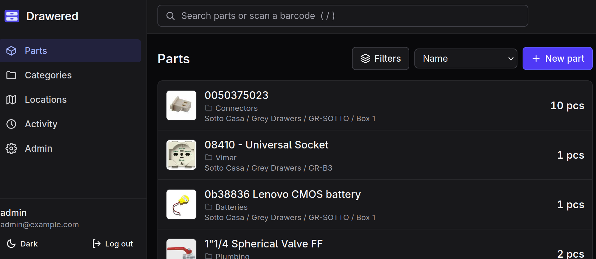

Drawered
========

A self-hosted parts-bin inventory: a user-defined hierarchy of locations,
parts stocked in any number of them, full-text search, a complete audit
trail, and OIDC sign-in with fine-grained roles. One Go binary with an
embedded Svelte UI and a SQLite database.



Quick trial with Docker Compose
-------------------------------

Drawered always signs users in through OIDC, so
[examples/trial](examples/trial) bundles a throwaway
[Dex](https://dexidp.io/) identity provider with one static user:

```
cd examples/trial
docker compose up        # or: podman compose up
```

Then open <http://localhost:8080> and log in as `admin@example.com` /
`password`. `docker compose down -v` removes everything, including the data
volume.

Production install with Docker Compose
--------------------------------------

[examples/production](examples/production) runs Drawered behind
[Caddy](https://caddyserver.com/), which obtains a TLS certificate
automatically. Point DNS for your host name at the server, register Drawered
with your IdP using the redirect URI `https://<host>/auth/callback`, then:

```
cd examples/production
cp env.example .env      # and fill it in
docker compose up -d     # or: podman compose up -d
```

If you already have a reverse proxy, drop the `caddy` service, publish
Drawered's port 8080 to it instead, and set `DRAWERED_TRUSTED_PROXIES` to
the address the proxy connects from. Back up the `drawered-data` volume (see
Running, below).

Requirements
------------

- Go 1.27+
- Node 20.19+ (for building the frontend only)
- An OIDC identity provider (Authentik, Keycloak, Entra ID, Google, ...)

Building
--------

```
make            # builds the frontend, then bin/drawered with it embedded
make test       # Go tests
make check      # formatting, vet, Go tests and svelte-check
```

Or with Docker:

```
docker build -t drawered .
```

Running
-------

Register Drawered with your IdP as a confidential or public client with the
redirect URI `<base URL>/auth/callback`, then:

```
DRAWERED_BASE_URL=https://drawered.example.com \
DRAWERED_OIDC_ISSUER=https://idp.example.com/application/o/drawered/ \
DRAWERED_OIDC_CLIENT_ID=drawered \
DRAWERED_OIDC_CLIENT_SECRET=... \
DRAWERED_BOOTSTRAP_ADMINS=you@example.com \
./bin/drawered serve
```

Users are created on first login. Users listed in
`DRAWERED_BOOTSTRAP_ADMINS` (email or subject) are given the Admin role, so
someone can get in to set up roles. New users get the default role (Read only
unless changed under Admin > Settings). To map IdP groups to roles, add claim
mappings under Admin > Claim mappings; set `DRAWERED_OIDC_SCOPES=groups` if
your IdP only sends groups when asked.

Drawered expects to run behind a TLS-terminating reverse proxy. All
configuration variables are listed in SPEC.md section 11.

Data lives in `DRAWERED_DATA_DIR` (default `./data`): `drawered.db` plus
`files/` and `renditions/`. Back up with Admin > System > Download backup, or
`drawered backup out.tar.gz`; restore by extracting into an empty data
directory.

Importing from InvenTree
------------------------

`drawered-import` copies stock locations, part categories, parts (one
supplier each), stock levels and part images from an InvenTree server into a
Drawered data directory. Back up first, then try a dry run:

```
INVENTREE_TOKEN=... DRAWERED_DATA_DIR=/srv/drawered \
    ./bin/drawered-import --url https://inventree.example.com --dry-run
```

Drop `--dry-run` to import. `INVENTREE_USERNAME` and `INVENTREE_PASSWORD` can
be used instead of a token. Re-running is safe: anything already imported
from that server is skipped. See SPEC.md section 18 for exactly what is
mapped, and `drawered-import -h` for options. With Docker:
`docker run --rm -v drawered-data:/data -e INVENTREE_TOKEN=... --entrypoint /drawered-import drawered --url ...`.

Development
-----------

```
make dev                  # backend on :8080 with OIDC bypassed
cd web && npm run dev     # frontend with hot reload on :5173, proxied to :8080
```

`make dev` builds with the `dev` tag, which honours `DRAWERED_DEV_AUTH` and
logs everyone in as that user. Production builds ignore it.

Go sources use four spaces rather than tabs; run `make fmt` (gofmt followed
by tab expansion) rather than plain `gofmt`.

AI use disclosure
-----------------

Much of this code is AI generated.

Licence
-------

Copyright (C) 2026 Paul G. Banks

This program is free software: you can redistribute it and/or modify it
under the terms of the GNU Affero General Public License as published by the
Free Software Foundation, either version 3 of the License, or (at your
option) any later version.

This program is distributed in the hope that it will be useful, but WITHOUT
ANY WARRANTY; without even the implied warranty of MERCHANTABILITY or
FITNESS FOR A PARTICULAR PURPOSE. See the GNU Affero General Public License
for more details.

You should have received a copy of the GNU Affero General Public License
along with this program. If not, see <https://www.gnu.org/licenses/>.
See the [LICENSE](LICENSE) file for the full text.

